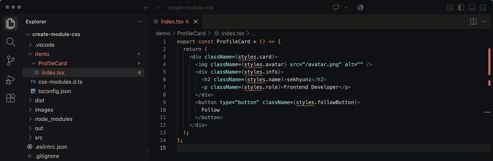

# Create Module CSS

Write `styles.xxx` in your component, run one command, and `index.module.css` is ready.

## Quick Start
Open a component file → `Cmd+Shift+P` (Windows/Linux: `Ctrl+Shift+P`) → run **Create Module CSS**.



**Before** (`Card.tsx`)
```tsx
export const Card = () => (
  <div className={styles.wrapper}>
    <h2 className={styles.title}>Hello</h2>
    <p className={styles.description}>World</p>
  </div>
);
```

**After** (`Card.tsx`): the import is added at the top
```tsx
import styles from './index.module.css';
export const Card = () => (
  ...
```

**After** (`index.module.css`): classes are declared in JSX order
```css
.wrapper {}

.title {}

.description {}
```

## Description
The "Create Module CSS" extension for Visual Studio Code and Cursor automatically generates an index.module.css file and inserts the necessary import statement into your JavaScript or TypeScript file. Additionally, it extracts the class names used in the file and ensures they are defined in the CSS file, maintaining the order they appear in the HTML structure.

## Features
- Automatically generates index.module.css if it does not exist.
- Adds the import styles from './index.module.css'; statement if it is not already present.
- Extracts class names from your JavaScript/TypeScript file and adds them to index.module.css if they are not already defined.
- Ensures class names are added in the order they appear in the HTML structure.
- Avoids adding duplicate class names to the CSS file.
- Ensures proper formatting with new lines between class definitions.

## Installation
- **VS Code**: [Visual Studio Marketplace](https://marketplace.visualstudio.com/items?itemName=sekhyuni.create-module-css)
- **Cursor / VSCodium**: [Open VSX](https://open-vsx.org/extension/sekhyuni/create-module-css)

Or from the editor:
1. Open Visual Studio Code (or Cursor).
1. Go to the Extensions view by clicking on the Extensions icon in the Activity Bar on the side of the window or by pressing Ctrl+Shift+X.
1. Search for "Create Module CSS".
1. Click on the install button for the "Create Module CSS" extension.

## Usage
1. Open a JavaScript or TypeScript file in the editor.
1. Run the "Create Module CSS" command from the command palette (Ctrl+Shift+P or Cmd+Shift+P on macOS).
1. The extension will:
    - Create an index.module.css file in the same directory if it does not already exist.
    - Add the import statement import styles from './index.module.css'; at the top of the file if it is not already present.
    - Extract class names used with the styles object and ensure they are defined in index.module.css.
